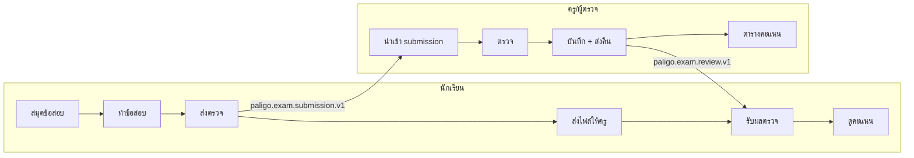

# Audit: User Flow ระบบสมุดข้อสอบ Paligo

วันที่ audit: 2026-07-07  
ขอบเขต: นักเรียน · ครู/ผู้ตรวจ · handoff ข้อมูล · navigation/shell

---

## Executive Summary

**Core loop ทำงานได้:** สร้างสมุด → เขียน (autosave) → ส่งตรวจ → ผู้ตรวจ stamp → leaderboard บนเครื่องเดียวกัน

**ช่องว่างหลัก (ก่อน P0 fix):** ไม่มีรับผลตรวจฝั่งนักเรียน · submit จบที่ download · สมุด submitted ยังแก้ได้ · หน้า exam/review ไม่มี shell ร่วม · reviewer ไม่โหลด stamp เดิม

**P0 ที่ implement ในรอบนี้:** ดู `CHANGELOG` ด้านล่าง

---

## Journey รวม

---

## Storage keys

| Key | เนื้อหา |
|-----|---------|
| `paligo-exam-answer-books-v1` | สมุดคำตอบหลายเล่ม |
| `paligo-exam-submissions-v1` | คิว submission |
| `paligo-exam-results-v1` | ผลตรวจ (reviewer + leaderboard) |
| `paligo-exam-received-reviews-v1` | ผลตรวจที่นักเรียนนำเข้า |
| `paligo-exam-active-book-id-v1` | เล่มที่เปิดล่าสุด |
| `paligo-exam-student-profile-v1` | โปรไฟล์นักเรียน |
| `paligo-exam-reviewer-profile-v1` | โปรไฟล์ผู้ตรวจ |

---

## Package schemas

| Schema | ทิศทาง |
|--------|--------|
| `paligo.exam.submission.v1` | นักเรียน → ผู้ตรวจ |
| `paligo.exam.review.v1` | ผู้ตรวจ → นักเรียน |
| `paligo.exam.bookTransfer.v1` | โอนสมุดสองทาง (→ ผู้ตรวจ / → นักเรียน) |
| `paligo.exam.answerBookExport.v1` | ย้ายเครื่อง (สมุด) |

---

## คะแนน audit ก่อนแก้

| มิติ | คะแนน |
|------|--------|
| นักเรียน เขียน→ส่ง | 7/10 |
| ผู้ตรวจ รับ→ส่งคืน | 6/10 |
| วนกลับนักเรียน | 1/10 |
| Navigation ข้ามบทบาท | 3/10 |
| Data contract | 8/10 |

---

## P0 Roadmap

| # | งาน | สถานะ |
|---|-----|--------|
| 1 | Shell ทุกหน้า exam/review/QA | ✅ |
| 2 | หน้ารับผลตรวจ `exam-review-results.html` | ✅ |
| 3 | Post-submit modal + ตรวจบนเครื่องนี้ | ✅ |
| 4 | Book identity bar ใน editor | ✅ |
| 5 | Pre-review header + โหลด stamp เดิม | ✅ |
| 6 | Lock/warn สมุด submitted | ✅ |
| 7 | ภาษาไทย title reviewer/leaderboard | ✅ |
| 8 | `paligo-exam-shared.js` ร่วม | ✅ |

---

## โมเดลโอนสมุดสองทาง (Book Transfer)

เหมือนโอนหนังสือไป–กลับระหว่างนักเรียน ↔ ผู้ตรวจ — **สมุดเดียวกันมองเห็นได้ทั้งสองฝ่าย** ต่างกันที่สถานะและสิทธิ์แก้ไข

| สถานะ | นักเรียน | ผู้ตรวจ |
|--------|----------|---------|
| `draft` | แก้คำตอบได้ | ดูได้ (ถ้ามีไฟล์) |
| `under_review` | ดูได้ · **แก้คำตอบไม่ได้** | ดูได้ · **แก้คำตอบไม่ได้** · stamp/ลายเซ็นได้ |
| `reviewed` | ดู stamp บนกระดาษ · ทำ revision ใหม่ได้ | ดูได้ · review layer ล็อก |

**แพ็กเกจโอน:** `paligo.exam.bookTransfer.v1`
- `direction: to-reviewer` — หลังส่งตรวจ (submission + book snapshot)
- `direction: to-student` — หลังตรวจเสร็จ (review + signature + คะแนน)

**UI หลัก:** `ruled-lines-card-only-template.html?mode=review&submissionId=...` — กระดาษเดียวกับนักเรียน + stamp overlay + ลายเซ็นภาพ

---

## ช่องโหว่ที่ยังเหลือ (หลัง transfer v1)

| ช่องโหว่ | ผลกระทบ |
|---------|---------|
| ยังไม่มี server/sync | โอนไฟล์ด้วยมือ — สองเครื่องไม่ realtime |
| `answerHash` ยังไม่ validate ตอน import | แก้คำตอบหลังส่งอาจไม่ถูกตรวจจับ |
| Console กับ Paper ยัง sync stamp แยก channel | stamp บน paper กับตาราง console อาจไม่ตรงถ้าใช้สลับกัน |
| ลายเซ็นยังไม่ลากตำแหน่ง | วางที่บรรทัดท้ายหน้าปัจจุบันเท่านั้น |
| ไม่มี audit trail การปลดล็อก | เปลี่ยนเป็น «ทำรอบใหม่» แล้ว แต่ยังไม่ log revision chain |
| Self-review / pairing ครู–นักเรียน | ยังไม่มี |

---

## P1 ค้าง (รอบถัดไป)

- ~~Confirm re-submit / dedupe ต่อ `bookId`~~ → ทำแล้วใน editor (confirm ก่อนส่งซ้ำ)
- ~~Import conflict dialog ที่ `exam-books.html`~~ → ทำแล้ว
- Stamp คลิกบนบรรทัด + แสดง annotations ฝั่ง reviewer
- `isSelfReview` + filter leaderboard
- LINE Flex adapter (ไม่ over-promise ใน toast)
- `answerHash` / `packageHash`
- Redirect เมื่อ `?resume=1` แต่ไม่มีเล่ม active

---

## กฎออกแบบ (ยึดต่อ)

1. เนื้อเรียนเป็นพระเอก — sidebar พับเป็นค่าเริ่มต้น
2. Handoff = หน้าถัดไป ไม่ใช่แค่ไฟล์
3. แสดง book identity ตลอดใน editor และก่อนตรวจ
4. Freeze หลังส่งตรวจ (readonly จนกดยืนยันแก้)
5. เมนูแก้ที่ `paligo-nav-config.js` เท่านั้น
6. **Change audit** — แก้/เพิ่มฟีเจอร์แล้วต้อง smoke test flow ที่เกี่ยวข้อง; อย่า regression นอก scope (`.cursor/rules/paligo-change-audit.mdc`)

---

## อ้างอิง

- `docs/system-flow-map.md`
- `docs/offline-data-safety-and-book-model.md`
- `docs/navigation-and-shell-prd.md`
- `.cursor/rules/paligo-navigation-shell.mdc`
