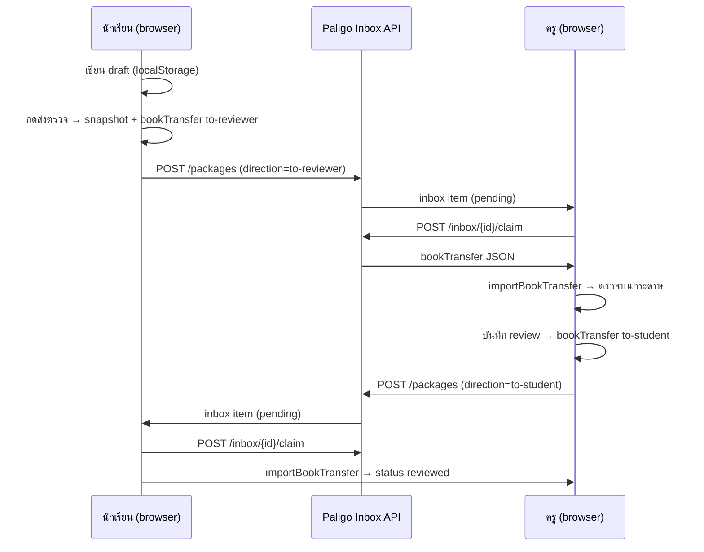

# Exam Inbox v1 — สเปค MVP

วันที่: 2026-07-07  
ขอบเขต: ส่งเล่ม → ครูรับ → ส่งกลับ · ไม่ตัด import/export (ย้ายไปเมนูเพิ่มเติม)

---

## 1. เป้าหมายและหลักการ

| หลัก | รายละเอียด |
|------|-------------|
| **Handoff หลัก** | Inbox บน server แทนไฟล์ `.paligo-book-transfer.json` ใน flow ปกติ |
| **Offline-first คงเดิม** | draft อยู่ local จนกด **ส่งตรวจ** — ตรง `docs/offline-online-sync-boundary.md` |
| **Advance fallback** | import/export ไฟล์โอน + backup ย้ายเครื่อง → เมนู **เพิ่มเติม** (ไม่โชว์ปุ่มหลัก) |
| **Payload เดิม** | ใช้ `paligo.exam.bookTransfer.v1` ที่ `buildBookTransfer()` สร้างอยู่แล้ว |
| **MVP auth** | บัญชีง่าย + จับคู่นักเรียน↔ครู (invite code) — ยังไม่ SSO |

### MVP user flow



---

## 2. สถานะสมุด (Book status)

### ฝั่ง client (`paligo-exam-shared.js` — คง schema เดิม)

| สถานะ | ความหมาย | อยู่ server? |
|--------|-----------|--------------|
| `draft` | ฉบับร่าง · แก้คำตอบได้ | ไม่ |
| `under_review` | ส่งตรวจแล้ว · รอ/อยู่ระหว่างตรวจ | ใช่ (หลัง push) |
| `reviewed` | ได้รับผลตรวจแล้ว | ใช่ (หลัง claim กลับ) |

**Transition หลังมี inbox**

```text
draft ──[ส่งตรวจ + push inbox]──► under_review
under_review ──[ครู claim + ตรวจ + push กลับ]──► reviewed (ฝั่งนักเรียนหลัง claim)
reviewed ──[ทำรอบใหม่]──► draft (revision ใหม่ — local เท่านั้น)
```

### ฝั่ง server (InboxItem)

| สถานะ | ความหมาย |
|--------|-----------|
| `pending` | รอผู้รับ claim |
| `claimed` | ผู้รับดึงแพ็กแล้ว |
| `expired` | หมดอายุ (default 30 วัน) |
| `cancelled` | ผู้ส่งยกเลิกก่อน claim |

---

## 3. ตาราง DB (โมเดลขั้นต่ำ)

เก็บ **metadata ใน SQL** · เก็บ **payload ใหญ่ใน object storage** (R2/S3/disk)

### `users`

| คอลัมน์ | ประเภท | หมายเหตุ |
|---------|--------|----------|
| `id` | UUID PK | |
| `role` | enum | `student` \| `reviewer` |
| `display_name` | text | ชื่อแสดงบนปก/inbox |
| `email` | text nullable | MVP: optional · magic link ภายหลัง |
| `password_hash` | text nullable | MVP: optional · หรือใช้ PIN 6 หลัก |
| `created_at` | timestamptz | |

### `pairings`

| คอลัมน์ | ประเภท | หมายเหตุ |
|---------|--------|----------|
| `id` | UUID PK | |
| `student_user_id` | FK → users | |
| `reviewer_user_id` | FK → users | |
| `invite_code` | text unique | ครูสร้าง · นักเรียนกรอกครั้งเดียว |
| `status` | enum | `active` \| `revoked` |
| `created_at` | timestamptz | |

### `packages`

| คอลัมน์ | ประเภท | หมายเหตุ |
|---------|--------|----------|
| `id` | UUID PK | = packageId บน server |
| `schema` | text | `paligo.exam.bookTransfer.v1` |
| `direction` | enum | `to-reviewer` \| `to-student` |
| `book_id` | text | client book UUID |
| `book_revision` | int | จาก submission |
| `submission_id` | text nullable | |
| `answer_hash` | text nullable | SHA-256 จาก client |
| `payload_storage_key` | text | path ใน R2/S3 |
| `payload_bytes` | int | สำหรับ quota |
| `from_user_id` | FK | |
| `created_at` | timestamptz | |

### `inbox_items`

| คอลัมน์ | ประเภท | หมายเหตุ |
|---------|--------|----------|
| `id` | UUID PK | |
| `package_id` | FK → packages | |
| `to_user_id` | FK → users | ผู้รับที่ถูกต้อง |
| `from_user_id` | FK → users | |
| `status` | enum | ดู §2 |
| `intended_recipient_label` | text | เช่น "ครู …" · แสดงก่อน claim |
| `book_title` | text | denormalize จาก payload summary |
| `subject` | text | denormalize |
| `grade` | text | denormalize |
| `expires_at` | timestamptz | default now + 30d |
| `claimed_at` | timestamptz nullable | |
| `created_at` | timestamptz | |

### `sessions` (MVP auth)

| คอลัมน์ | ประเภท | หมายเหตุ |
|---------|--------|----------|
| `id` | UUID PK | token ใน httpOnly cookie |
| `user_id` | FK | |
| `expires_at` | timestamptz | |
| `created_at` | timestamptz | |

**Index แนะนำ:** `(to_user_id, status, created_at DESC)`, `(book_id, book_revision)`, `(invite_code)`.

---

## 4. API endpoints (REST v1)

Base: `https://api.paligo.example/v1` · Auth: `Authorization: Bearer <session>` หรือ httpOnly cookie

### Auth & pairing

| Method | Path | บทบาท | คำอธิบาย |
|--------|------|--------|-----------|
| `POST` | `/auth/register` | public | `{ role, displayName, email?, pin? }` → session |
| `POST` | `/auth/login` | public | `{ email or userId, pin }` → session |
| `POST` | `/auth/logout` | user | ลบ session |
| `GET` | `/me` | user | โปรไฟล์ + pairing ที่ active |
| `POST` | `/pairings/invite` | reviewer | สร้าง invite_code |
| `POST` | `/pairings/join` | student | `{ inviteCode }` → ผูกครู |

### Inbox (MVP core)

| Method | Path | บทบาท | คำอธิบาย |
|--------|------|--------|-----------|
| `GET` | `/inbox` | user | รายการ `pending` (+ optional `claimed` ล่าสุด) |
| `GET` | `/inbox/{id}` | recipient | รายละเอียด + `intendedRecipientLabel` (ยังไม่ให้ payload) |
| `POST` | `/inbox/{id}/claim` | recipient | ตรวจ `to_user_id` + role · คืน `bookTransfer` JSON · ตั้ง `claimed` |
| `POST` | `/inbox/{id}/cancel` | sender | ยกเลิกก่อน claim |

### Packages (push)

| Method | Path | บทบาท | คำอธิบาย |
|--------|------|--------|-----------|
| `POST` | `/packages` | student/reviewer | body = `paligo.exam.bookTransfer.v1` · สร้าง package + inbox ให้คู่ที่ pair |
| `GET` | `/packages/{id}/meta` | owner/sender/recipient | metadata ไม่มี pages |

**กฎ business (server enforce)**

1. `direction=to-reviewer` → ส่งได้เฉพาะ `role=student` · ต้องมี pairing active · สร้าง inbox ให้ `reviewer_user_id`
2. `direction=to-student` → ส่งได้เฉพาะ `role=reviewer` · ต้องมี `review` ใน payload · inbox ให้ `student_user_id`
3. Reject ถ้า `answer_hash` ไม่ตรงกับ pages ใน payload (phase 1.1)
4. Dedupe: ถ้ามี `pending` inbox เดิม `book_id` + `book_revision` + direction เดิม → 409 หรือ replace ตาม policy

**Response ตัวอย่าง `POST /packages`**

```json
{
  "packageId": "…",
  "inboxItemId": "…",
  "status": "pending",
  "intendedRecipientLabel": "ครู …"
}
```

---

## 5. การเชื่อม client (ไฟล์ที่แตะ)

| ไฟล์ | การเปลี่ยน |
|------|------------|
| `paligo-exam-shared.js` | เพิ่ม `PaligoInboxClient` (fetch wrapper) · `pushBookTransfer()` · `claimInboxItem()` |
| `ruled-lines-card-only-template.html` | หลังส่งตรวจ: ปุ่มหลัก **ส่งเข้า inbox ครู** แทน download |
| `exam-reviewer-console.html` | แท็บ **Inbox** · claim → `importBookTransfer()` |
| `exam-books.html` | แท็บ/ปุ่ม **กล่องข้อความ** · ย้าย import/export ไป **เพิ่มเติม → โอนไฟล์ (ขั้นสูง)** |
| `exam-inbox.html` (ใหม่) | รายการ inbox รวมทั้งสอง role |

**Delivery adapter** (ตาม `offline-online-sync-boundary.md`):

```text
Submit Gate → buildBookTransfer() → InboxAdapter.push()  // หลัก
                                  → FileAdapter.download() // เพิ่มเติมเท่านั้น
```

---

## 6. UX: เมนูเพิ่มเติม (Advance)

ย้ายออกจาก toolbar หลัก:

- นำเข้าแพ็กเกจโอน
- ส่งออกแพ็กเกจโอน (to-reviewer / to-student)
- ส่งออกสมุด backup (`paligo.exam.answerBookExport.v1`)
- นำเข้าสมุด backup

คงไว้ใน flow หลัก:

- ส่งตรวจ → **ส่งเข้า inbox**
- Inbox → **รับเข้าคลัง**
- ดูผลตรวจ / คะแนน

---

## 7. นอกขอบเขต MVP v1

- Push notification / LINE
- Leaderboard กลาง
- Multi-reviewer / ห้องเรียน
- End-to-end encryption
- Admin dashboard

---

## 8. เกณฑ์สำเร็จ MVP

1. นักเรียน 2 บัญชี + ครู 1 บัญชี จับคู่ด้วย invite code ได้
2. ส่งตรวจแล้วครูเห็นใน inbox ภายใน 5 วินาที
3. ครู claim แล้วเปิด editor โหมด review ได้
4. ครูส่งกลับ · นักเรียน claim · สถานะ `reviewed` + stamp บนกระดาษ
5. Import/export ยังใช้ได้จากเมนูเพิ่มเติม
6. Draft ไม่ถูก sync ขึ้น server

---

## 9. อ้างอิง

- `paligo-exam-shared.js` — `BOOK_STATUS`, `buildBookTransfer`, `importBookTransfer`
- `docs/offline-online-sync-boundary.md`
- `docs/exam-flow-ux-audit.md`
- `docs/exam-inbox-hosting-recommendation.md`
