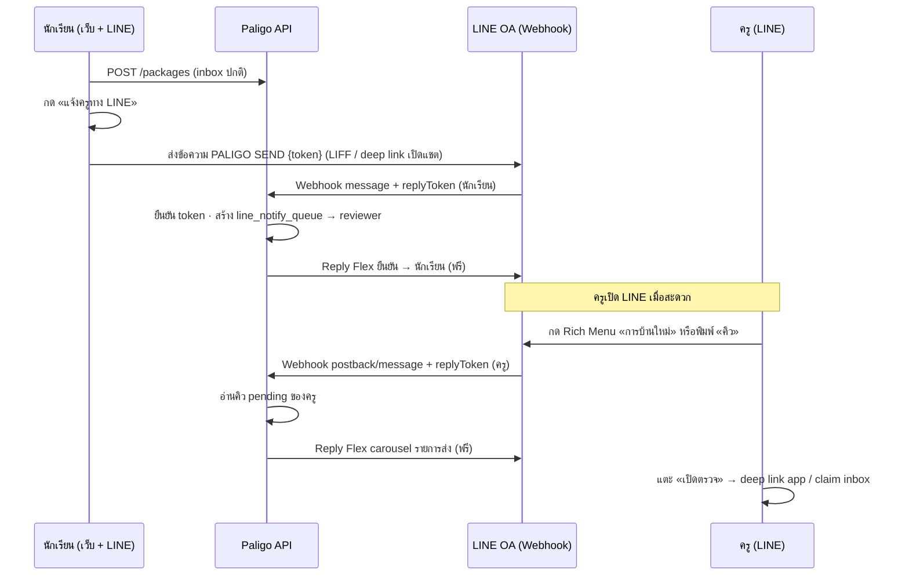

# Phase 8 — LINE Flex ผ่าน Webhook (Reply-only · ไม่ Push)

วันที่: 2026-07-07  
สถานะ: **ออกแบบ · รอ Inbox loop (Phase 4) ครบก่อนเริ่ม implement**  
อ้างอิง: `docs/exam-inbox-v1-spec.md`, `docs/offline-online-sync-boundary.md`, `docs/agile/inbox-sprint-backlog.md`

---

## 1. เป้าหมาย

| เป้า | รายละเอียด |
|------|-------------|
| แจ้งครูเมื่อนักเรียนส่งสมุดข้อสอบ | Flex Message สรุป (ชื่อ · ป.ธ. · เล่ม · เวลา) — **ไม่ใส่คำตอบเต็ม** |
| **Reply เท่านั้น** | ไม่ใช้ Push / Multicast / Broadcast (ไม่นับ quota · ไม่เสียเงิน) |
| Trigger จากนักเรียน | เกิดจากการกด **ส่งตรวจ + แจ้งครูทาง LINE** หลัง push inbox |
| ผูก LINE ID | ครู (reviewer) เชื่อมบัญชี Inbox ↔ LINE userId ในหน้าตั้งค่า |
| นักเรียน (ทางเลือก) | ผูก LINE เพื่อรับ Flex ยืนยันการส่ง · รับผลตรวจใน phase ถัดไป |

---

## 2. ข้อจำกัดสำคัญของ LINE Messaging API

### 2.1 Reply vs Push

| วิธี | replyToken | ค่าใช้จ่าย | ใช้เมื่อ |
|------|------------|-----------|----------|
| **Reply** | ต้องมีจาก webhook event ของ **ผู้รับ event คนนั้น** | **ฟรี** | ตอบใน thread ที่ user/bot โต้ตอบอยู่ |
| **Push** | ไม่ต้องมี | **นับ quota / เสียเงิน** | ส่งหา user โดยไม่มี interaction ล่าสุด |

### 2.2 ทำไม “นักเรียน trigger → ครูได้ Flex แบบ reply ทันที” ทำตรงๆ ไม่ได้

`replyToken` ผูกกับ **conversation + event ที่เกิดขึ้น** — ถ้านักเรียนส่งข้อความมาที่ OA ได้ token ของ **นักเรียน** จะ **reply กลับหานักเรียนเท่านั้น** ไม่สามารถใช้ token นั้น reply ไปหา `line_user_id` ของครูได้

```text
❌ ไม่ได้: นักเรียนกดส่ง (web) → server ใช้ replyToken ของนักเรียน → ส่ง Flex หาครู
✅ ได้:   ครูกด Rich Menu / ส่งข้อความหา OA → server ได้ replyToken ของครู → ส่ง Flex หาครู (ฟรี)
✅ ได้:   นักเรียน trigger → server เก็บคิวแจ้ง → ครูเปิด LINE → ได้ Flex แบบ reply
```

### 2.3 replyToken หมดอายุเร็ว (~30 วินาที–หลายนาที)

ไม่เหมาะเก็บ token ไว้รอครูเปิด LINE ทีหลัง — ต้อง **reply ทันที** ตอน webhook เข้ามา

---

## 3. แนวทางที่แนะนำ: **Deferred Reply + Student Trigger**

รวม 3 ชั้น — ได้ trigger จากนักเรียน + ครูได้ Flex ฟรี + ไม่ push

### 3.1 ภาพรวม



### 3.2 Student trigger (คำสั่งจากนักเรียน)

หลัง `POST /v1/packages` สำเร็จ:

1. Server สร้าง **one-time notify token** (สั้น 8–12 ตัว, TTL 15 นาที) ผูก `inbox_item_id`
2. UI แสดงปุ่ม **แจ้งครูทาง LINE** → เปิด:
   - `https://line.me/R/oaMessage/{@oaId}/?PALIGO%20SEND%20{a8b9c2d1}`  
   - หรือ LIFF ที่เรียก `liff.openWindow({ url: 'line://...' })`
3. นักเรียนส่งข้อความ (หรือ OA รับ auto ถ้าใช้ postback จาก LIFF flex button)
4. Webhook รับ event → validate token → insert `line_notify_queue(reviewer_id, inbox_item_id, status=pending)`
5. **Reply ทันที** ให้นักเรียน Flex ยืนยัน: «ส่งแล้ว · ครู {ชื่อ} จะเห็นเมื่อเปิดเมนูการบ้าน»

> ถ้านักเรียนไม่กดแจ้ง LINE — inbox ยังทำงานปกติ (ครูเปิดเว็บ / Rich Menu ดูคิวได้)

### 3.3 Teacher receive (reply ฟรี)

ครูที่ผูก `line_user_id` แล้ว:

| วิธีเปิด session | Event | Reply ที่ส่ง |
|----------------|-------|--------------|
| Rich Menu **การบ้านใหม่ (N)** | postback | Flex carousel รายการ `pending` สูงสุด 5 รายการ |
| พิมพ์ `คิว` / `การบ้าน` | message | เหมือนกัน |
| หลัง follow OA ครั้งแรก | follow | ข้อความต้อนรับ + วิธีผูกบัญชี |

Flex bubble ต่อรายการ (metadata เท่านั้น):

- ชื่อนักเรียน · ป.ธ. · ชื่อเล่ม · เวลาส่ง
- ปุ่ม postback `action=open_inbox&id={inboxItemId}` → reply ข้อความ + URI `https://app.paligo.jp/exam-reviewer-console.html?inboxId=...`
- **ไม่ใส่** เนื้อคำตอบ / hash เต็ม

### 3.4 ทางเลือกเสริม (ยังไม่ push)

| แนวทาง | ข้อดี | ข้อจำกัด |
|--------|-------|----------|
| **A. Deferred Reply** (แนะนำหลัก) | ฟรี · อัตomation เกือบเต็ม | ครูต้องเปิด LINE / กดเมนู (ไม่ realtime แบบ push) |
| **B. LIFF shareTargetPicker** | นักเรียนแชร์ Flex ให้ครูตรงๆ · bot ไม่ push | ไม่ auto · ต้องเลือก contact · ไม่ผ่าน inbox queue |
| **C. กลุ่ม LINE ห้องเรียน** | bot reply ใน group เมื่อนักเรียน @bot | ต้องมี group · privacy |
| **D. Push (ไม่ใช้)** | realtime | เสีย quota — **นอก scope phase นี้** |

---

## 4. การผูก LINE ID (Account Linking)

### 4.1 ครู (บังคับสำหรับรับแจ้ง)

**Flow A — รหัสจากเว็บ (ไม่ต้อง LIFF ซับซ้อน)**

```text
1. ครู login ที่ exam-account.html → แท็บ «เชื่อม LINE»
2. กด «สร้างรหัสผูก» → API คืน LINK-482913 (TTL 10 นาที)
3. ครู add OA เป็นเพื่อน → ส่งข้อความ: PALIGO LINK 482913
4. Webhook: ตรวจรหัส · บันทึก users.line_user_id · reply ยืนยัน
5. เว็บ poll GET /v1/integrations/line/status → แสดง «เชื่อมแล้ว ✓»
```

**Flow B — LIFF Login (UX ดีกว่า · phase 8.2)**

```text
1. เปิด LIFF จากแท็บเชื่อม LINE
2. liff.getProfile() → userId
3. POST /v1/integrations/line/link { idToken จาก liff.getIDToken() }
4. Server verify กับ LINE Login channel
```

### 4.2 นักเรียน (ทางเลือก)

- ผูกด้วย flow เดียวกัน — ใช้ trigger `PALIGO SEND` และรับผลตรวจแบบ reply ใน phase 9
- ถ้าไม่ผูก: ใช้ deep link เปิดแชต OA ด้วยข้อความ prefilled (LINE ยัง identify user จากแชต)

### 4.3 DB (migration 0003)

```sql
-- users
ALTER TABLE users ADD COLUMN line_user_id TEXT;
CREATE UNIQUE INDEX idx_users_line_user_id ON users(line_user_id) WHERE line_user_id IS NOT NULL;
ALTER TABLE users ADD COLUMN line_linked_at TEXT;

-- คิวแจ้งครู (สร้างเมื่อนักเรียน trigger สำเร็จ)
CREATE TABLE line_notify_queue (
  id TEXT PRIMARY KEY,
  inbox_item_id TEXT NOT NULL REFERENCES inbox_items(id),
  reviewer_user_id TEXT NOT NULL REFERENCES users(id),
  student_user_id TEXT NOT NULL REFERENCES users(id),
  notify_token TEXT,
  status TEXT NOT NULL DEFAULT 'pending', -- pending | delivered | cancelled
  created_at TEXT NOT NULL,
  delivered_at TEXT
);

-- one-time tokens สำหรับ PALIGO SEND / PALIGO LINK
CREATE TABLE line_link_tokens (
  token TEXT PRIMARY KEY,
  user_id TEXT NOT NULL REFERENCES users(id),
  purpose TEXT NOT NULL, -- link | notify
  inbox_item_id TEXT,
  expires_at TEXT NOT NULL,
  used_at TEXT
);
```

---

## 5. API & Webhook (Workers)

### 5.1 Routes ใหม่

| Method | Path | Auth | หมายเหตุ |
|--------|------|------|----------|
| `POST` | `/v1/webhooks/line` | LINE signature | รับ events · **ไม่ Bearer** |
| `GET` | `/v1/integrations/line/status` | Bearer | สถานะการผูก |
| `POST` | `/v1/integrations/line/link-code` | Bearer reviewer/student | สร้างรหัส PALIGO LINK |
| `DELETE` | `/v1/integrations/line/link` | Bearer | ยกเลิกการผูก |
| `POST` | `/v1/line/notify-token` | Bearer student | หลัง push package · คืน token สำหรับ PALIGO SEND |

### 5.2 Webhook handler (`workers/src/line-webhook.js`)

```text
verifySignature(body, X-Line-Signature, LINE_CHANNEL_SECRET)
switch event.type:
  message  → handleText(source.userId, text, replyToken)
  postback → handlePostback(source.userId, data, replyToken)
  follow   → welcome + วิธี LINK
  unfollow → clear line_user_id (optional soft-unlink)
```

คำสั่งข้อความ (prefix `PALIGO`):

| คำสั่ง | ผู้ส่ง | การทำงาน |
|--------|--------|----------|
| `PALIGO LINK {code}` | ครู/นักเรียน | ผูก `line_user_id` |
| `PALIGO SEND {token}` | นักเรียน | enqueue แจ้งครู + reply ยืนยัน |
| `คิว` / `การบ้าน` | ครูที่ผูกแล้ว | reply Flex carousel |

### 5.3 Secrets (Wrangler)

```text
LINE_CHANNEL_SECRET
LINE_CHANNEL_ACCESS_TOKEN
LINE_OA_ID                    # @handle สำหรับ deep link
LINE_LIFF_ID                  # phase 8.2
```

---

## 6. หน้าตั้งค่า UI

### 6.1 ตำแหน่ง

**แนะนำ:** แท็บใหม่ **เชื่อม LINE** ใน `exam-account.html` (role reviewer เป็นหลัก · student เห็นแบบย่อ)

**ทางเลือก:** `exam-line-settings.html` + ลง `paligo-nav-config.js` หมวด «ครูและผู้ตรวจ»

### 6.2 เนื้อหาหน้า (ครู)

| บล็อก | รายละเอียด |
|-------|------------|
| สถานะ | ยังไม่เชื่อม / เชื่อมแล้ว (แสดง displayName จาก LINE ถ้ามี) |
| ขั้นตอน | 1) Add OA  2) สร้างรหัส  3) ส่ง PALIGO LINK ในแชต |
| QR | QR ไป OA + ปุ่ม «คัดลอกรหัส» |
| ทดสอบ | ปุ่ม «ลองดึงคิวใน LINE» → เปิด deep link พิมพ์ `คิว` |
| ยกเลิก | ถอนการผูก |
| คำอธิบาย | แจ้งเตือนฟรีแบบ reply — ครูต้องเปิด LINE หรือกด Rich Menu (ไม่ push) |

### 6.3 ฝั่งนักเรียน (ใน flow ส่งตรวจ)

หลังส่ง inbox สำเร็จ (`paligo-exam-submit.js`):

```text
☑ แจ้งครูทาง LINE (ฟรี · ครูจะเห็นเมื่อเปิด LINE)
[ เปิด LINE LIFF ]  ← แสดงเมื่อ `features.lineLiffNotify === true`
```

### 6.4 LIFF หน้าเว็บ + ไอคอนแจ้งเตือน (**script push** · ไม่ใช่ LINE push)

> **หมายเหตุ:** ไม่ใช่ LINE Notify (ปิดแล้ว) · ไม่ใช่ Messaging API **push** — เป็น **JavaScript อัปเดต badge ใน DOM**

| ไฟล์ | หน้าที่ |
|------|--------|
| `exam-line-liff.html` | หน้า LIFF (Rich Menu → Endpoint URL) |
| `paligo-line-liff-notify.js` | `PaligoLineLiffNotify.push({ pendingInbox })` — **script push** |
| `paligo-line-liff.js` | init LIFF · โหลด inbox · ปุ่ม「แจ้งการส่ง」|

```text
Rich Menu「ส่งการบ้าน」→ เปิด LIFF (exam-line-liff.html)
  → poll GET /inbox (หรือ refresh ด้วยมือ)
  → PaligoLineLiffNotify.push({ pendingInbox, notifyQueued })  // อัปเดต 🔔 badge
  → นักเรียนกด「แจ้งการส่ง」→ คิวแจ้งครู (API 8.3) + toast ใน LIFF
  → (ทางเลือก) liff.sendMessages → webhook reply Flex ในแชต (ยัง reply-only)
```

**สามชั้นแจ้งเตือน (อย่าสับสน):**

| ชั้น | กลไก | ใช้เมื่อ |
|------|------|----------|
| **Script push** | `PaligoLineLiffNotify.push()` | badge บนหน้า LIFF · realtime ใน WebView |
| **LINE reply** | webhook + Reply API | ข้อความ/Flex ในแชต OA (ฟรี) |
| ~~LINE Notify~~ | ปิด 31 มี.ค. 2025 | **ไม่ใช้** |
| ~~Messaging push~~ | นอก scope | **ไม่ใช้** |

ตั้งค่า: `PALIGO_LINE_LIFF_ID` หรือ `?liffId=` · Endpoint = `https://app.paligo.jp/exam-line-liff.html`

---

## 7. Flex Message ตัวอย่าง (bubble สรุป)

```json
{
  "type": "flex",
  "altText": "มีสมุดข้อสอบใหม่จาก สมชาย ป.ธ. ๗",
  "contents": {
    "type": "bubble",
    "hero": { "type": "box", "backgroundColor": "#1F2D89", "height": "80px", "contents": [] },
    "body": {
      "type": "box",
      "layout": "vertical",
      "contents": [
        { "type": "text", "text": "สมุดข้อสอบใหม่", "weight": "bold", "size": "lg" },
        { "type": "text", "text": "สมชาย · ป.ธ. ๗", "size": "sm", "color": "#666666" },
        { "type": "text", "text": "มาติกา ๒๙ · ส่ง ๗ ก.ค. ๒๐:๑๕", "size": "xs", "color": "#999999" }
      ]
    },
    "footer": {
      "type": "box",
      "layout": "vertical",
      "contents": [
        {
          "type": "button",
          "action": {
            "type": "postback",
            "label": "เปิดตรวจบนเว็บ",
            "data": "action=open_inbox&id=..."
          },
          "style": "primary"
        }
      ]
    }
  }
}
```

---

## 8. แบ่ง Phase ย่อย (Implementation)

| Sub-phase | งาน | DoD |
|-----------|-----|-----|
| **8.0** | LINE OA + webhook verify + echo test | POST webhook 200 · signature ผ่าน |
| **8.1** | DB link + PALIGO LINK + แท็บเชื่อม LINE | ครูผูก account ได้ |
| **8.2** | Rich Menu ครู + reply Flex คิว pending | ครูพิมพ์ `คิว` เห็นรายการ |
| **8.3** | Student PALIGO SEND + notify queue | trigger จากนักเรียนหลังส่งตรวจ |
| **8.4** | LIFF link + shareTargetPicker fallback | UX ไม่ต้องพิมพ์รหัส |
| **8.5** | Flex ผลตรวจกลับนักเรียน (reply เมื่อ claim to-student) | หลัง Phase 4 |

**อย่าเริ่ม 8.x จน Phase 4 (inbox loop) Done**

---

## 9. Privacy & ความปลอดภัย

- Flex ส่งเฉพาะ metadata (`bookTitle`, `grade`, `studentName`, `submittedAt`) — ไม่ส่ง `pages[]` / `answerHash`
- `notify_token` one-time + TTL สั้น
- Webhook ต้อง verify `X-Line-Signature` ทุก request
- `line_user_id` ผูกกับ Paligo user หลัง login เท่านั้น (รหัส LINK ออกจาก session ที่ auth แล้ว)
- Log ไม่เก็บ replyToken

---

## 10. สรุปคำตอบ PO

| คำถาม | คำตอบ |
|--------|--------|
| ส่ง Flex แบบ reply ไปหาครูได้ไหม? | **ได้ แต่ต้องให้ครู (หรือ OA) เป็นคนก่อเหตุการณ์** — กด Rich Menu / พิมพ์คำสั่ง · ไม่ใช่ reply จาก trigger ของนักเรียนโดยตรง |
| นักเรียน trigger ได้ไหม? | **ได้** — สร้างคิวแจ้ง + นักเรียนส่ง `PALIGO SEND` → ครูได้ Flex เมื่อเปิด LINE |
| ไม่ push ได้ไหม? | **ได้** ถ้าใช้ reply-only + deferred queue (แนวทางหลัก) |
| หน้าตั้งค่าครู? | แท็บ **เชื่อม LINE** ใน `exam-account.html` — รหัส LINK + QR OA |

---

## 11. อ้างอิง LINE Developers

- [Send messages — Reply vs Push](https://developers.line.biz/en/docs/messaging-api/sending-messages/)
- [Messaging API pricing — Reply ไม่นับ quota](https://developers.line.biz/en/docs/messaging-api/pricing/)
- [Receive messages (webhook)](https://developers.line.biz/en/docs/messaging-api/receiving-messages/)
