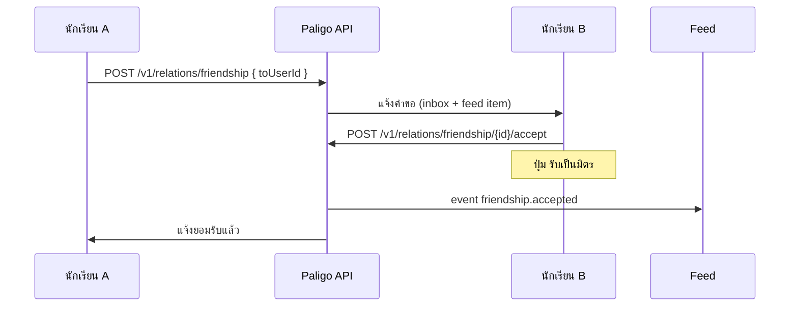
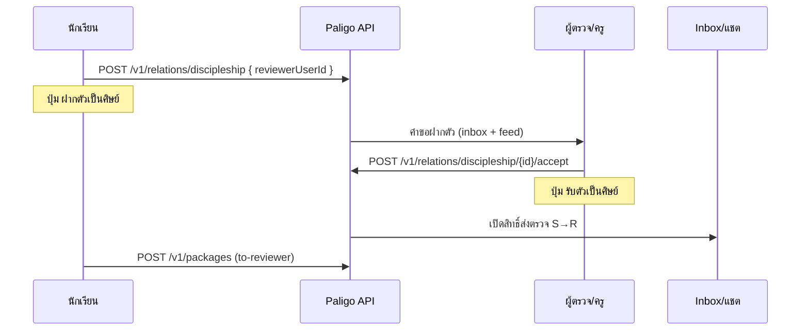

# Phase 9–10 — กัลยาณมิตร · ศิษย์ · Feed กิจกรรม

วันที่: 2026-07-07  
สถานะ: **ออกแบบ · รอ Inbox loop (Phase 4) + Phase 7 คิวตรวจ (ทางเลือก) ก่อน implement**  
อ้างอิง: `docs/exam-inbox-v1-spec.md`, `docs/exam-scoring-leaderboard-plan.md`, `docs/system-flow-map.md`, `docs/phase-line-reply-webhook.md`

---

## 1. คำศัพท์ UI (บังคับ — ห้ามใช้คำอื่นในปุ่มหลัก)

| แนวคิด | ปุ่ม/คำที่ใช้ | ผู้กด | ผู้รับคำขอ | หมายเหตุ |
|--------|---------------|--------|------------|----------|
| เพิ่มเพื่อน | **เพิ่มกัลยาณมิตร** | นักเรียน → นักเรียน | **รับเป็นมิตร** | มิตรภาพ · ไม่ใช้ส่งตรวจอย่างเป็นทางการ |
| เพิ่มครู | **ฝากตัวเป็นศิษย์** | นักเรียน → ผู้ตรวจ/ครู | **รับตัวเป็นศิษย์** | ผูก ID สำหรับ **ส่งตรวจ** · แทน/ขยาย invite code ปัจจุบัน |
| คำขอรอดำเนินการ | คำขอมิตรภาพ / คำขอฝากตัว | — | — | แสดงใน inbox + feed |

**Scope ความสัมพันธ์**

| ประเภท | จาก | ถึง | ใช้ส่งตรวจ? | ใช้ feed? |
|--------|-----|-----|-------------|----------|
| `friendship` | `student` | `student` | ไม่ | ใช่ (กิจกรรมสังคม · คะแนนที่อนุญาตแชร์) |
| `discipleship` | `student` | `reviewer` | **ใช่** | ใช่ (ส่งตรวจ · ผลตรวจ · leaderboard) |

ห้าม `reviewer` ↔ `reviewer` เป็นมิตรใน MVP phase นี้ (ขยายภายหลังได้)

---

## 2. ความสัมพันธ์กับระบบปัจจุบัน

### 2.1 สิ่งที่มีแล้ว

| ส่วน | สถานะ | ไฟล์/API |
|------|--------|----------|
| จับคู่ invite code | ครูสร้างรหัส · นักเรียน join ครั้งเดียว | `POST /v1/pairings/invite`, `/join` |
| ส่งตรวจ | ต้องมี pairing active | `POST /v1/packages` |
| แชต inbox (local) | thread ตาม pairing | `paligo-inbox-chat.js`, `exam-inbox.html` |
| Leaderboard | อ่านผลตรวจ local | `exam-leaderboard.html` |
| บทบาะ server | `student` \| `reviewer` เท่านั้น | `users.role` |

### 2.2 การย้ายจาก invite code → ฝากตัวเป็นศิษย์

```text
Phase 9.0  คง invite code เป็น fallback (ขั้นสูง)
Phase 9.1  เพิ่มคำขอฝากตัวเป็นศิษย์ (pending → รับตัวเป็นศิษย์ → active)
Phase 9.2  ส่งตรวจใช้ discipleship เป็นหลัก · pairing เก่า migrate เป็น discipleship
Phase 9.3  deprecate UI รหัสจับคู่ (เก็บ API ไว้รอบนึง)
```

---

## 3. User flow

### 3.1 กัลยาณมิตร (นักเรียน ↔ นักเรียน)



- ปฏิเสธ: `POST .../decline` · ยกเลิกมิตร: `DELETE .../friendship/{id}`
- หลัง active: เห็น feed ของกัน (ตาม privacy) · เปิดแชต thread `friend-{minId}-{maxId}`

### 3.2 ฝากตัวเป็นศิษย์ (นักเรียน → ผู้ตรวจ)



- นักเรียนมีได้ **หลายศิษย์-ครู** (หลาย discipleship active) — เลือกผู้รับตอนส่งตรวจ
- ต่างจาก MVP ปัจจุบันที่ pairing ทับกันได้คนเดียว

### 3.3 Feed — ความเคลื่อนไหว

**แหล่ง event (server-side)**

| event_type | trigger | ผู้เห็น (default) |
|------------|---------|-------------------|
| `review.score_published` | ครู push ผล + อนุญาต leaderboard | ศิษย์ + ครูที่ตรวจ · มิตร (ถ้า opt-in) |
| `leaderboard.announcement` | cron / ครูประกาศ | discipleship group · มิตรที่ opt-in |
| `discipleship.requested` | ฝากตัวเป็นศิษย์ | ผู้ตรวจเป้าหมาย |
| `discipleship.accepted` | รับตัวเป็นศิษย์ | ทั้งสองฝ่าย |
| `friendship.requested` | เพิ่มกัลยาณมิตร | ผู้รับคำขอ |
| `friendship.accepted` | รับเป็นมิตร | ทั้งสองฝ่าย |
| `book.submitted` | push inbox สำเร็จ | ศิษย์ + ครู (metadata เท่านั้น) |
| `book.reviewed` | claim ผลกลับ | ศิษย์ |

**หน้า UI:** `exam-feed.html` (ใหม่) · สรุปการ์ดใน `index.html` · deep link ไป leaderboard / ผลตรวจ

**Privacy (จาก `exam-scoring-leaderboard-plan.md`)**

- leaderboard บน feed ใช้ **alias/nickname** default
- ไม่ใส่คำตอบเต็มใน feed · มีแค่คะแนน % · ชื่อเล่ม · วิชา · วันที่

---

## 4. โมเดลข้อมูล (API)

### 4.1 ตารางใหม่

```sql
-- มิตรภาพ นักเรียน-นักเรียน
CREATE TABLE friendships (
  id TEXT PRIMARY KEY,
  requester_user_id TEXT NOT NULL REFERENCES users(id),
  addressee_user_id TEXT NOT NULL REFERENCES users(id),
  status TEXT NOT NULL, -- pending | active | declined | blocked | cancelled
  created_at TEXT NOT NULL,
  responded_at TEXT,
  UNIQUE(requester_user_id, addressee_user_id)
);

-- ศิษย์-ครู (แทนที่ pairings ในระยะยาว)
CREATE TABLE discipleships (
  id TEXT PRIMARY KEY,
  student_user_id TEXT NOT NULL REFERENCES users(id),
  reviewer_user_id TEXT NOT NULL REFERENCES users(id),
  status TEXT NOT NULL, -- pending | active | declined | revoked
  created_at TEXT NOT NULL,
  responded_at TEXT,
  UNIQUE(student_user_id, reviewer_user_id)
);

-- Feed (server truth)
CREATE TABLE feed_events (
  id TEXT PRIMARY KEY,
  actor_user_id TEXT REFERENCES users(id),
  event_type TEXT NOT NULL,
  visibility TEXT NOT NULL, -- discipleship | friends | self | public_alias
  payload_json TEXT NOT NULL,
  created_at TEXT NOT NULL
);

CREATE TABLE feed_recipients (
  feed_event_id TEXT NOT NULL REFERENCES feed_events(id),
  user_id TEXT NOT NULL REFERENCES users(id),
  read_at TEXT,
  PRIMARY KEY (feed_event_id, user_id)
);
```

### 4.2 Routes (ร่าง)

| Method | Path | หมายเหตุ |
|--------|------|----------|
| `POST` | `/v1/relations/friendship` | เพิ่มกัลยาณมิตร |
| `POST` | `/v1/relations/friendship/{id}/accept` | รับเป็นมิตร |
| `POST` | `/v1/relations/friendship/{id}/decline` | ปฏิเสธ |
| `DELETE` | `/v1/relations/friendship/{id}` | ยกเลิกมิตร |
| `POST` | `/v1/relations/discipleship` | ฝากตัวเป็นศิษย์ |
| `POST` | `/v1/relations/discipleship/{id}/accept` | รับตัวเป็นศิษย์ |
| `POST` | `/v1/relations/discipleship/{id}/decline` | ปฏิเสธ |
| `DELETE` | `/v1/relations/discipleship/{id}` | ถอนศิษย์/เลิกรับ |
| `GET` | `/v1/relations` | รายการมิตร + ศิษย์/ครู |
| `GET` | `/v1/feed` | cursor pagination |
| `POST` | `/v1/feed/{id}/read` | mark read |

### 4.3 เปลี่ยน `POST /v1/packages`

- ตรวจ `discipleship` active ระหว่าง student กับ reviewer เป้าหมาย (แทน `pairings` เดียว)
- body เพิ่ม `reviewerUserId` เมื่อนักเรียนมีหลายครู

---

## 5. UI ที่ต้องมี

| หน้า | การเปลี่ยน |
|------|------------|
| `exam-account.html` | แท็บ **กัลยาณมิตร** · **ครู/ศิษย์** · รายการคำขอรอ |
| `exam-inbox.html` | คำขอมิตร/ศิษย์เป็นการ์ด · ปุ่ม รับเป็นมิตร / รับตัวเป็นศิษย์ |
| `exam-feed.html` | **ใหม่** — timeline กิจกรรม |
| `workbook.html` | เลือกครูผู้รับเมื่อส่งตรวจ (ถ้ามี >1 discipleship) |
| `exam-leaderboard.html` | ปุ่ม «ประกาศขึ้น feed» (ครู · opt-in) |
| `paligo-nav-config.js` | เมนู Feed · กัลยาณมิตร |

---

## 6. ทีมงาน · User flow · Audit ช่องโหว่

### 6.1 โครงทีม (3 ทีม + 1 audit ร่วม)

```text
┌─────────────────────────────────────────────────────────────┐
│  PO / Human — ตัดสิน Decision · ยืนยันคำศัพท์ UI            │
└─────────────────────────────────────────────────────────────┘
         │                    │                    │
         ▼                    ▼                    ▼
┌─────────────────┐  ┌─────────────────┐  ┌─────────────────┐
│ Team A          │  │ Team B          │  │ Team C          │
│ Relations API   │  │ Social UX       │  │ Feed & Score    │
│ D1 schema       │  │ ปุ่มมิตร/ศิษย์   │  │ leaderboard→feed│
│ auth enforce    │  │ exam-account    │  │ exam-feed.html  │
└────────┬────────┘  └────────┬────────┘  └────────┬────────┘
         │                    │                    │
         └────────────────────┼────────────────────┘
                              ▼
                 ┌────────────────────────┐
                 │ Team D — Seam Audit    │
                 │ E2E · รอยต่อ · privacy │
                 └────────────────────────┘
```

| ทีม |  Deliverables | Agent หลัก |
|-----|---------------|------------|
| **A — Relations** | migrations · API · migrate pairing→discipleship | cursor-ai |
| **B — Social UX** | ปุ่มตามคำศัพท์ · inbox cards · คำขอรอ | cursor-ai |
| **C — Feed** | feed_events · UI timeline · hook หลัง review/leaderboard | cursor-ai |
| **D — Seam Audit** | checklist · E2E script · รายงานช่องโหว่ | human + cursor-ai |

### 6.2 รอบ Audit (ทุก sprint ย่อยของ Phase 9)

1. **Flow walkthrough** — อ่าน diagram ในเอกสารนี้ + `docs/system-flow-map.md`
2. **Seam matrix** — ตาราง §7 ด้านล่าง · ทุกช่องต้อง PASS หรือมี Decision
3. **Role matrix** — student/reviewer ลองทุกปุ่มข้ามบทบาท (ต้อง 403)
4. **Privacy pass** — feed ไม่รั่ว draft · ไม่รั่วคำตอบเต็ม
5. **Handoff** — ใช้ template ใน `docs/agile/AGENT-HANDOFF.md`

### 6.3 Definition of Done — Phase 9 รวม

- [ ] นักเรียน A กด **เพิ่มกัลยาณมิตร** → B กด **รับเป็นมิตร** → ทั้งคู่เห็น feed ของกัน (อย่างน้อย event ยอมรับ)
- [ ] นักเรียนกด **ฝากตัวเป็นศิษย์** → ครูกด **รับตัวเป็นศิษย์** → ส่งตรวจ inbox ได้
- [ ] หลังตรวจ + push คะแนน → feed ศิษย์ + ครู มี `review.score_published`
- [ ] ประกาศ leaderboard → ปรากฏ feed ตาม visibility
- [ ] Seam audit §7 ไม่มีรายการ P0 ค้าง

---

## 7. Seam matrix — รอยต่อที่มักขาด (และวิธีเชื่อม)

| # | รอยต่อ | ความเสี่ยง | อาการที่ user เจอ | วิธีเชื่อม (Design) | ทีม |
|---|--------|------------|-------------------|---------------------|-----|
| S1 | **pairings (เก่า) ↔ discipleships (ใหม่)** | สูง | ส่งตรวจไม่ได้หลัง migrate | script migrate · API รับทั้งคู่ช่วง transition · UI บอกให้ฝากตัวใหม่ | A |
| S2 | **local chat ↔ server feed** | สูง | ส่งตรวจเห็นในแชตแต่ feed ว่าง | หลัง `pushPackage` → API สร้าง feed_event + client `recordBookSubmission` | A+C |
| S3 | **หลายครู ↔ เลือกผู้รับตอนส่งตรวจ** | สูง | ส่งผิดครู | modal เลือก discipleship ก่อน push · default ครูล่าสุด | B |
| S4 | **friendship ↔ ส่งตรวจ** | กลาง | คิดว่ามิตรส่งตรวจให้กันได้ | UI ชัด: มิตร ≠ ศิษย์ · ปุ่มส่งตรวจเฉพาะ discipleship | B |
| S5 | **leaderboard local ↔ feed server** | สูง | คะแนนขึ้น board แต่ไม่ขึ้น feed | หลัง review push → `POST /v1/feed/publish-score` (server) | C |
| S6 | **reviewer role ไม่แยก teacher / assistant** | กลาง | สิทธิ์สับสน | เพิ่ม `reviewer_kind` optional · หรือ metadata ใน profile | A |
| S7 | **threadId แชต** | กลาง | ข้อความกระจายผิดห้อง | มาตรฐาน: `disciple-{studentId}-{reviewerId}` · `friend-{sortedIds}` | B |
| S8 | **คำขอ pending ไม่ sync** | สูง | กดรับแล้วอีกฝ่ายไม่รู้ | ทุก accept → feed_event + inbox system message | A+B |
| S9 | **Privacy / alias** | สูง | ชื่อจริงรั่วบน feed | `displayAlias` ใน feed payload · default จาก profile | C+D |
| S10 | **Offline draft ↔ social** | กลาง | กดฝากตั้วโดยไม่ login | gate ที่ exam-account · ข้อความไทยชัด | B |
| S11 | **Phase 8 LINE ↔ discipleship** | กลาง | แจ้ง LINE แต่ไม่มีศิษย์ | webhook ใช้ `discipleship` ไม่ใช่ pairing เก่า | A (หลัง 8) |
| S12 | **Navigation shell** | ต่ำ | หา feed ไม่เจอ | ลง `paligo-nav-config.js` + rule shell | B |

### 7.1 Brainstorm ร่วมเมื่อ audit พบช่อง

ใช้ลำดับนี้ใน issue GitHub:

1. **Reproduce** — 2 browser profiles · บันทึก URL + ปุ่มที่กด
2. **Classify** — P0 (ส่งตรวจ/ privacy) · P1 (UX สับสน) · P2 (cosmetic)
3. **Owner** — ทีม A/B/C ตามตาราง
4. **Fix pattern** — prefer **server event เดียว** แล้วให้ client ฟัง (feed + inbox + แชต local)
5. **Regression** — เพิ่มแถวใน seam matrix · อัปเดต E2E checklist

---

## 8. แบ่ง Phase ย่อย

| Sub | งาน | ขึ้นกับ |
|-----|-----|---------|
| **9.0** | Schema friendships + discipleships · GET /relations | Phase 4 |
| **9.1** | UI คำขอ + รับเป็นมิตร / รับตัวเป็นศิษย์ | 9.0 |
| **9.2** | packages ใช้ discipleship · เลือกครูตอนส่ง | 9.1 |
| **9.3** | Migrate pairing → discipleship | 9.2 |
| **10.0** | feed_events API + exam-feed.html | 9.2 |
| **10.1** | review.score_published + leaderboard.announcement | 10.0 + server review push |
| **10.2** | Seam audit E2E + privacy review | 10.1 |

---

## 9. E2E script (ร่าง — Team D)

```text
1. Student S login · Reviewer R login · Student F (friend) login
2. S → ฝากตัวเป็นศิษย์ → R → รับตัวเป็นศิษย์
3. S → เพิ่มกัลยาณมิตร F → F → รับเป็นมิตร
4. S สร้างสมุด · ส่งตรวจ → R claim · ตรวจ · push กลับ
5. ตรวจ: S feed มี reviewed · R feed มี score_published
6. R ประกาศ leaderboard → S + F (opt-in) เห็น announcement
7. ลองส่งตรวจโดยไม่มี discipleship → 403 + ข้อความไทย
8. ลอง F รับศิษย์ (role student) → 403
```

---

## 10. อ้างอิง

- `docs/agile/inbox-sprint-backlog.md` — Phase 9–10
- `docs/agile/AGENT-HANDOFF.md` — handoff ระหว่างทีม
- `docs/exam-flow-ux-audit.md` — audit UX exam
- `docs/offline-online-sync-boundary.md` — ห้าม draft ขึ้น feed
