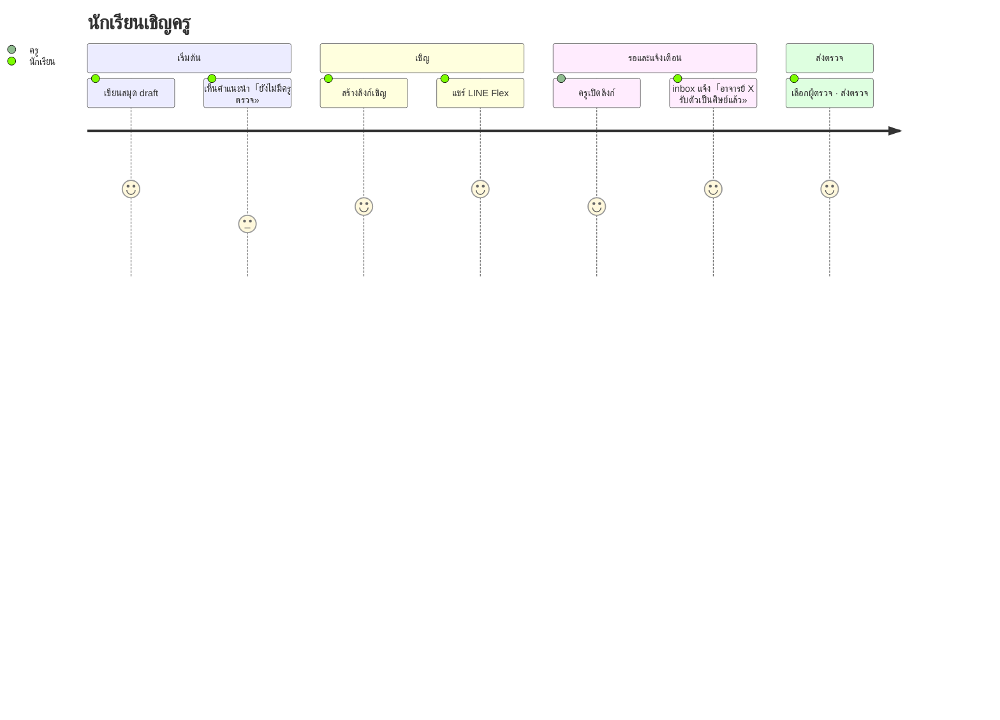
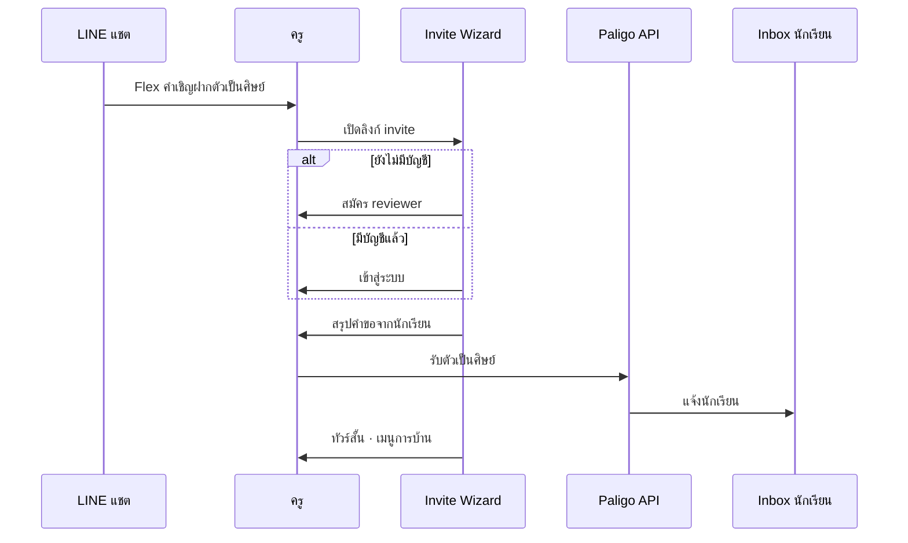
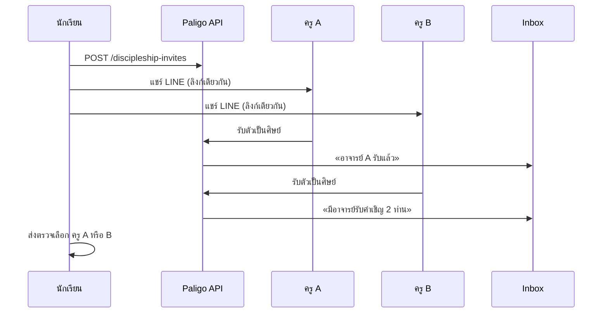

# PRD: จับคู่ครูตรวจ · เชิญอาจารย์ · Onboarding ผู้ตรวจ (Paligo Web)

| ฟิลด์ | ค่า |
|-------|-----|
| **สถานะ** | Draft — วิสัยทัศน์ PO · พร้อมออกแบบ sprint |
| **วันที่** | 2026-07-08 |
| **ผลิตภัณฑ์** | Paligo Web (`app.paligo.jp`) — ไม่รวมแอป iOS |
| **Epic** | Teacher matching & onboarding |
| **อ้างอิง** | [`exam-inbox-v1-spec.md`](exam-inbox-v1-spec.md) · [`phase-social-relations-feed.md`](phase-social-relations-feed.md) · [`phase-line-reply-webhook.md`](phase-line-reply-webhook.md) · [`inbox-sprint-backlog.md`](agile/inbox-sprint-backlog.md) Phase 8.5 |

---

## 1. วิสัยทัศน์ (Vision)

**ผู้เรียนบาลีทุกคนที่เข้า Paligo ควรมีทางไปถึงผู้ตรวจที่ไว้ใจได้ — ไม่ว่าจะมาจากเครือข่ายสถาบัน หรือตามหาครูประจำของตนเอง — และส่งข้อสอบตรวจได้ภายในไม่กี่นาทีหลังสมัคร**

Paligo ไม่ใช่แค่สมุดข้อสอบดิจิทัล แต่เป็น **วงจรเรียน → ส่งตรวจ → รับผล** การมีครูในระบบคือจุดเชื่อมที่ทำให้วงจรนี้สมบูรณ์

---

## 2. ปัญหา (Problem Statement)

### 2.1 Pain point หลัก

นักเรียนที่เข้ามาใช้แพลตฟอร์ม **อยากเรียนบาลี** และเขียนคำตอบบนสมุดดิจิทัลได้แล้ว แต่ **ยังไม่มีอาจารย์หรือผู้ตรวจ** ในระบบที่จะรับตรวจข้อสอบ

### 2.2 ผลกระทบ

| ปัญหา | ผลต่อนักเรียน | ผลต่อแพลตฟอร์ม |
|--------|----------------|-----------------|
| ไม่มี pairing / discipleship | กด「ส่งตรวจ」ไม่ได้ · inbox ว่าง | Activation ต่ำ · churn สูง |
| ไม่รู้วิธีหาครู | ทิ้งแพลตฟอร์มหลังลองเขียนสมุด | ค่า CAC สูงโดยไม่ได้ loop |
| ครูคนเดียวรับภาระหนัก | ครูไม่รับ invite · นักเรียนรอนาน | Supply ขาดแคลน |
| ครูใหม่ไม่รู้ใช้ระบบ | รับ invite แล้วไม่กลับมาตรวจ | Conversion invite → ตรวจจริง ต่ำ |

### 2.3 โอกาส

- นักเรียนส่วนใหญ่มีครูประจำอยู่แล้ว (วัด / โรงเรียน / ติว) แต่ครูยังไม่ได้อยู่ใน Paligo
- LINE เป็น channel หลักของครูและนักเรียนในประเทศไทย — แชร์คำเชิญผ่าน Flex + `shareTargetPicker` ลด friction
- รองรับ **หลายผู้ตรวจต่อนักเรียน** ช่วยกระจายภาระและสะท้อนความเป็นจริง (มีหลายอาจารย์ดูแล)

---

## 3. เป้าหมายและตัวชี้วัดความสำเร็จ

### 3.1 เป้าหมายผลิตภัณฑ์

| # | เป้าหมาย |
|---|----------|
| G1 | ลดเวลา **สมัครแล้ว → มีครูรับตรวจได้จริง** ให้สั้นที่สุด |
| G2 | นักเรียนไม่ต้องรู้ technical flow (API, pairing code) ล่วงหน้า |
| G3 | ครูใหม่เข้าใจวิธีรับเล่มและส่งผลกลับภายใน session แรก |
| G4 | กระจายภาระตรวจเมื่อนักเรียนมีผู้ตรวจมากกว่า 1 คน |

### 3.2 Metrics (หลัง launch)

| Metric | นิยาม | เป้า MVP |
|--------|--------|----------|
| **Time-to-first-reviewer** | นาทีจาก register นักเรียน → discipleship active คนแรก | < 24 ชม. (median) |
| **Invite acceptance rate** | % invite ที่มี ≥1 ครูรับตัวเป็นศิษย์ | > 40% |
| **Wizard completion** | % ครูใหม่ที่จบ invite wizard ถึงรับศิษย์ | > 70% |
| **First submission rate** | % นักเรียนที่มีครูแล้วและส่งตรวจภายใน 7 วัน | > 50% |

---

## 4. กลุ่มผู้ใช้ (Personas)

### 4.1 นักเรียน — «นนท์» ป.ธ. ๓

- เรียนบาลีที่วัด · มีอาจารย์ประจำ 2 ท่าน (วินัยธร + แปล)
- ใช้มือถือและ LINE ทุกวัน · ไม่คุ้น invite code
- ต้องการ: ส่งสมุดให้ครูตรวจได้โดยไม่ต้อง copy ไฟล์

### 4.2 ครู — «อาจารย์สมชาย»

- สอนบาลีมานาน · ตรวจกระดาษเป็นประจำ
- ไม่เคยใช้ Paligo · เปิดลิงก์จาก LINE
- ต้องการ: เข้าใจเร็วว่าต้องทำอะไรหลังกดลิงก์

### 4.3 Ops / Super admin — «ทีม Paligo»

- เปิดตัวกับสถาบันที่มีครูในเครือข่ายอยู่แล้ว
- ต้องการ: seed บัญชี reviewer ล่วงหน้า · เปิด inbox feature flag

---

## 5. ขอบเขต (Scope)

### 5.1 In scope (MVP)

| หมวด | รายละเอียด |
|------|-------------|
| Supply | Seed ครูล่วงหน้า (super admin) · รายการครูที่รับศิษย์ |
| Demand | นักเรียนสร้าง invite link · แชร์ LINE Flex + `shareTargetPicker` |
| Multi-reviewer | ลิงก์เดียว · ครูหลายคนรับ invite / รับตัวเป็นศิษย์ได้ |
| Teacher onboarding | Invite wizard (สมัคร → รับศิษย์ → ทัวร์สั้น) |
| Student notify | Inbox แจ้ง 1 ท่าน / หลายท่าน · สถานะรับศิษย์ |
| Submit | เลือกผู้ตรวจ 1 คนตอนกด「ส่งตรวจ」 |

### 5.2 Out of scope (MVP)

- แบ่งข้อสอบเป็นชุดย่อยส่งคนละข้อ (phase ถัดไป)
- AI ตรวจแทนครู (PALI-AI track แยก)
- Marketplace หาครูแบบสุ่ม / matching algorithm
- Push notification LINE แบบเสีย quota (ใช้ reply + แชร์จากนักเรียน)

---

## 6. แนวทางแก้ปัญหา (Solution Overview)

ใช้ **สองทางคู่กัน** — ไม่ mutually exclusive:

```text
ทาง A (Supply)     Ops / สถาบัน seed ครูล่วงหน้า → นักเรียนเลือกจากรายการ
ทาง B (Demand)     นักเรียนสร้างลิงก์ → แชร์ LINE → ครูตามหาเองเข้าระบบ
```

### 6.1 ทาง A — มีอาจารย์ในระบบล่วงหน้า

| ขั้น | พฤติกรรม |
|------|----------|
| 1 | Ops สร้างบัญชี `reviewer` ผ่าน super admin |
| 2 | ครู login · ตั้งโปรไฟล์ · เปิดรับศิษย์ |
| 3 | นักเรียนเลือกครูจากรายการ · กด「ฝากตัวเป็นศิษย์」 |
| 4 | ครูรับใน inbox · discipleship active |

อ้างอิง: [`super-admin-control-panel.md`](super-admin-control-panel.md)

### 6.2 ทาง B — นักเรียนตามหาครู (LINE invite)

| ขั้น | พฤติกรรม |
|------|----------|
| 1 | นักเรียนกด「เชิญอาจารย์」→ สร้าง invite link + Flex payload |
| 2 | เปิด LIFF `shareTargetPicker` · เลือกครูหลายคนใน LINE |
| 3 | ครูได้ Flex «ขอฝากตัวเป็นศิษย์» · กดเปิดลิงก์ |
| 4 | Invite wizard นำทางสมัคร/ล็อกอิน → **รับตัวเป็นศิษย์** |
| 5 | นักเรียนเห็น inbox สรุปว่ามีใครรับแล้ว |

> **คำศัพท์ UI (บังคับ):** ฝากตัวเป็นศิษย์ · รับตัวเป็นศิษย์ — [`phase-social-relations-feed.md`](phase-social-relations-feed.md) §1

---

## 7. User journeys

### 7.1 นักเรียน — เชิญครูผ่าน LINE



### 7.2 ครู — รับคำเชิญครั้งแรก



### 7.3 นักเรียน — หลายครูรับคำเชิญ



---

## 8. ความต้องการเชิงฟังก์ชัน (Functional Requirements)

### 8.1 Invite & discipleship

| ID | ความต้องการ | Priority |
|----|-------------|----------|
| FR-01 | นักเรียนสร้าง invite token ที่หลายครูใช้ร่วมกันได้ | P0 |
| FR-02 | Invite มีสถานะ: `active` · `expired` · `cancelled` | P0 |
| FR-03 | ครูเปิดลิงก์แล้วบันทึกเหตุการณ์ `invite_opened` | P1 |
| FR-04 | ครูกด「รับตัวเป็นศิษย์」→ สร้าง discipleship `active` | P0 |
| FR-05 | ครูปฏิเสธคำเชิญได้ · ไม่สร้าง discipleship | P1 |
| FR-06 | นักเรียนยกเลิก invite กลางคันได้ | P1 |
| FR-07 | นักเรียนมี discipleship หลายรายการพร้อมกัน | P0 |
| FR-08 | คง invite code เดิมเป็น fallback (ขั้นสูง) | P2 |

### 8.2 LINE integration

| ID | ความต้องการ | Priority |
|----|-------------|----------|
| FR-10 | คืน Flex bubble JSON สำหรับแชร์คำเชิญ | P0 |
| FR-11 | LIFF `shareTargetPicker` เลือกผู้รับหลายคน | P0 |
| FR-12 | ปุ่ม Flex เปิด `inviteUrl` (เว็บหรือ LIFF) | P0 |
| FR-13 | ไม่ใช้ LINE Push quota สำหรับ flow หลัก | P0 |

### 8.3 Invite wizard (ครู)

| ID | ความต้องการ | Priority |
|----|-------------|----------|
| FR-20 | Deep link คง `invite` token หลัง refresh | P0 |
| FR-21 | ข้าม step สมัครถ้ามี session reviewer แล้ว | P0 |
| FR-22 | Step โปรไฟล์ขั้นต่ำ: ชื่อแสดงใน inbox | P0 |
| FR-23 | Step เชื่อม LINE (ทางเลือก · ข้ามได้) | P2 |
| FR-24 | หลังรับศิษย์ → ทัวร์สั้น 3 จุด: รับเล่ม · ตรวจ · ส่งกลับ | P1 |
| FR-25 | Redirect ไป `exam-reviewer-console.html` เมื่อจบ | P1 |

### 8.4 Inbox & แจ้งนักเรียน

| ID | ความต้องการ | Priority |
|----|-------------|----------|
| FR-30 | Inbox type `discipleship_invite` แสดงสถานะคำเชิญ | P0 |
| FR-31 | แจ้งเมื่อครูรับตัวเป็นศิษย์ (รายคน) | P0 |
| FR-32 | สรุปการ์ด「มีอาจารย์รับคำเชิญ N ท่าน」 | P0 |
| FR-33 | ข้อความชี้แจง: เลือกผู้ตรวจตอนส่งข้อสอบเพื่อแบ่งภาระ | P0 |
| FR-34 | แจ้งเตือนในแอปเป็นหลัก · LINE เป็นทางเลือก | P0 |

### 8.5 ส่งตรวจ & แบ่งภาระ

| ID | ความต้องการ | Priority |
|----|-------------|----------|
| FR-40 | กด「ส่งตรวจ」ต้องเลือกผู้ตรวจจาก discipleship active | P0 |
| FR-41 | `POST /packages` รับ `reviewer_user_id` ที่เลือก | P0 |
| FR-42 | แสดงชื่อครู + สถานะคิว (ถ้ามี Phase 7) | P2 |
| FR-43 | แนะนำผู้ตรวจที่คิวน้อยกว่า | P2 |

### 8.6 Supply-side (ops)

| ID | ความต้องการ | Priority |
|----|-------------|----------|
| FR-50 | Super admin สร้างบัญชี reviewer | P2 |
| FR-51 | รายการครูที่เปิดรับศิษย์สาธารณะ (ทางเลือก) | P2 |

---

## 9. ความต้องการ UX / ข้อความ UI

### 9.1 Empty state — นักเรียนไม่มีครู

แสดงบน `exam-books.html` หรือ `exam-inbox.html` เมื่อไม่มี discipleship:

```text
หัวข้อ: ยังไม่มีอาจารย์ผู้ตรวจ
เนื้อหา: เมื่อมีอาจารย์รับตัวเป็นศิษย์แล้ว คุณจะส่งสมุดข้อสอบเข้าตรวจได้
ปุ่มหลัก: เชิญอาจารย์
ปุ่มรอง: ฝากตัวเป็นศิษย์ (เลือกจากรายการ) — เมื่อมี supply
```

### 9.2 ข้อความ inbox (ตัวอย่าง)

| เหตุการณ์ | ข้อความ |
|-----------|---------|
| ครูเปิดลิงก์ | «อาจารย์ {ชื่อ} เปิดคำเชิญแล้ว» |
| รับศิษย์ 1 คน | «อาจารย์ {ชื่อ} รับตัวเป็นศิษย์แล้ว — พร้อมส่งข้อสอบตรวจได้» |
| รับศิษย์หลายคน | «มีอาจารย์รับคำเชิญ **{n} ท่าน** — เลือกส่งข้อสอบให้ท่านใดก็ได้» |
| ก่อนส่งตรวจ | «เลือกผู้ตรวจเพื่อไม่ให้ครูท่านใดท่านหนึ่งรับภาระมากเกินไป» |

### 9.3 Invite wizard — ขั้นตอน

| Step | หัวข้อ | เนื้อหาสั้น |
|------|--------|-------------|
| 1 | ยินดีต้อนรับ | {ชื่อนักเรียน} ขอให้คุณเป็นผู้ตรวจข้อสอบบาลี |
| 2 | เข้าสู่ระบบ | สมัครหรือเข้าสู่ระบบในฐานะผู้ตรวจ |
| 3 | โปรไฟล์ | ชื่อที่แสดงเมื่อนักเรียนส่งสมุดมา |
| 4 | เชื่อม LINE | รับแจ้งการบ้านใน LINE (ข้ามได้) |
| 5 | รับศิษย์ | สรุปคำขอ · ปุ่ม「รับตัวเป็นศิษย์」 |
| 6 | เริ่มตรวจ | ทัวร์: เมนูการบ้าน → รับเล่ม → ส่งผลกลับ |

### 9.4 LINE Flex bubble

| องค์ประกอบ | เนื้อหา |
|------------|---------|
| Header | คำเชิญฝากตัวเป็นศิษย์ |
| Body | {ชื่อนักเรียน} · {ชั้น ป.ธ. ถ้ามี} |
| Subtext | ขอให้คุณเป็นผู้ตรวจข้อสอบบาลีบน Paligo |
| ปุ่ม | เปิดคำเชิญ → `inviteUrl` |

---

## 10. โมเดลข้อมูล (Draft)

### 10.1 `discipleship_invites`

| คอลัมน์ | ประเภท | หมายเหตุ |
|---------|--------|----------|
| `id` | UUID PK | |
| `token` | TEXT UNIQUE | ใน URL |
| `student_user_id` | FK users | |
| `status` | enum | `active` \| `expired` \| `cancelled` |
| `expires_at` | TEXT | default +30 วัน |
| `created_at` | TEXT | |

### 10.2 `discipleship_invite_claims`

| คอลัมน์ | ประเภท | หมายเหตุ |
|---------|--------|----------|
| `id` | UUID PK | |
| `invite_id` | FK | |
| `reviewer_user_id` | FK | |
| `opened_at` | TEXT | nullable |
| `status` | enum | `opened` \| `accepted` \| `declined` |

### 10.3 `discipleships` (ขยาย Phase 9)

| คอลัมน์ | ประเภท | หมายเหตุ |
|---------|--------|----------|
| `id` | UUID PK | |
| `student_user_id` | FK | |
| `reviewer_user_id` | FK | |
| `status` | enum | `pending` \| `active` \| `ended` |
| `invite_id` | FK nullable | |
| `created_at` | TEXT | |

### 10.4 Inbox item types ใหม่

| `type` | ผู้รับ | ความหมาย |
|--------|--------|----------|
| `discipleship_invite_update` | student | สรุปสถานะคำเชิญ |
| `discipleship_accepted` | student | ครูรับตัวเป็นศิษย์แล้ว |

---

## 11. API (Draft)

| Method | Path | Auth | หมายเหตุ |
|--------|------|------|----------|
| POST | `/v1/discipleship-invites` | student | คืน `token`, `inviteUrl`, `flexPayload` |
| GET | `/v1/discipleship-invites/{token}` | public | metadata สำหรับ wizard |
| POST | `/v1/discipleship-invites/{token}/open` | reviewer | บันทึก opened |
| POST | `/v1/discipleship-invites/{token}/accept` | reviewer | รับตัวเป็นศิษย์ |
| POST | `/v1/discipleship-invites/{token}/decline` | reviewer | ปฏิเสธ |
| DELETE | `/v1/discipleship-invites/{id}` | student | ยกเลิก |
| GET | `/v1/me/discipleships` | both | รายการศิษย์/ครู |
| POST | `/v1/packages` | student | + `reviewer_user_id` (ขยาย) |

---

## 12. ความต้องการที่ไม่ใช่ฟังก์ชัน (NFR)

| หัวข้อ | ข้อกำหนด |
|--------|----------|
| ภาษา UI | ไทยทั้งหมด — [`thai-ui-language-rules.md`](thai-ui-language-rules.md) |
| Privacy | ไม่ใส่เนื้อคำตอบใน Flex LINE |
| Offline | draft ยังอยู่ local จนกดส่งตรวจ — [`offline-online-sync-boundary.md`](offline-online-sync-boundary.md) |
| Security | invite token สุ่ม · TTL · rate limit เปิดลิงก์ |
| Accessibility | wizard รองรับ keyboard · ข้อความชัด ไม่พึ่งสีอย่างเดียว |

---

## 13. Phasing & Dependencies

| ลำดับ | ต้องมีก่อน | งาน |
|-------|------------|-----|
| 0 | — | Inbox loop จบ (Phase 4) |
| 1 | Phase 4 | Discipleship model (Phase 9) |
| 2 | Phase 9 | Invite URL หลายผู้รับ |
| 3 | Phase 2 | LINE Flex + shareTargetPicker |
| 4 | Phase 2–3 | Invite wizard |
| 5 | Phase 4 | Inbox แจ้งนักเรียน |
| 6 | Phase 5 | เลือกผู้ตรวจตอนส่งตรวจ |
| 7 | — | Seed ครู (ops) |

Backlog รายละเอียด: [`agile/inbox-sprint-backlog.md`](agile/inbox-sprint-backlog.md) **Phase 8.5**

---

## 14. ความเสี่ยงและสมมติฐาน

| ความเสี่ยง | ผลกระทบ | การบรรเทา |
|------------|---------|-----------|
| ครูไม่ยอมสมัคร | invite ค้าง | ทัวร์สั้น · ลดฟิลด์บังคับ · seed ครูสถาบัน |
| นักเรียนแชร์ผิดคน | privacy | ข้อความใน Flex ไม่มีเนื้อสอบ |
| ครูหลายคนรับแต่ไม่ตรวจ | นักเรียนสับสน | แสดงสถานะ「ยังไม่เคยรับเล่ม」 |
| LIFF ไม่รองรับเบราว์เซอร์เก่า | แชร์ไม่ได้ | fallback copy link |

**สมมติฐาน:**

- นักเรียนส่วนใหญ่มี LINE
- ครูยินดีรับ invite ถ้า flow ใช้เวลา < 5 นาที
- หลายครูต่อนักเรียนเป็นกรณีปกติใน ป.ธ. ชั้นสูง

---

## 15. Acceptance criteria (Release)

- [ ] นักเรียนไม่มีครู → empty state + ปุ่ม「เชิญอาจารย์」
- [ ] แชร์ LINE ผ่าน shareTargetPicker · Flex ถูกต้อง
- [ ] ครู ≥2 คนเปิดลิงก์เดียวกันและรับตัวเป็นศิษย์ได้
- [ ] ครูใหม่ผ่าน wizard จบใน session เดียว
- [ ] Inbox แสดง 1 ท่าน / หลายท่าน พร้อมข้อความแบ่งภาระ
- [ ] ส่งตรวจเลือกผู้ตรวจจากรายการ active
- [ ] (ทางเลือก) ops seed ครูผ่าน super admin

---

## 16. เปิดคำถาม (PO decisions)

| # | คำถาม | แนวโน้ม |
|---|--------|---------|
| 1 | invite หมดอายุกี่วัน? | 30 วัน |
| 2 | จำกัดจำนวนครูต่อ invite? | ไม่จำกัด MVP · แจ้งเตือนถ้า >5 |
| 3 | หน้า wizard แยกไฟล์หรือ modal ใน `exam-account.html`? | หน้าใหม่ `exam-invite-wizard.html` |
| 4 | รายการครูสาธารณะเปิดเมื่อไหร่? | หลัง seed สถาบันแรก |

---

## 17. เอกสารที่เกี่ยวข้อง

| เอกสาร | บทบาท |
|--------|--------|
| [`teacher-invite-onboarding-vision.md`](teacher-invite-onboarding-vision.md) | สรุปสั้น vision (PO brief) |
| [`pali-learning-app-prd-roadmap.md`](pali-learning-app-prd-roadmap.md) | PRD หลัก · pain points รวม |
| [`phase-social-relations-feed.md`](phase-social-relations-feed.md) | ฝากตัวเป็นศิษย์ · คำศัพท์ UI |
| [`phase-line-reply-webhook.md`](phase-line-reply-webhook.md) | LINE · shareTargetPicker |
| [`exam-inbox-v1-spec.md`](exam-inbox-v1-spec.md) | Inbox loop · packages |

---

*PRD ฉบับนี้จัดเก็บวิสัยทัศน์ PO สำหรับ epic จับคู่ครูตรวจ — อัปเดตเมื่อมีการตัดสินใจจาก sprint planning*
