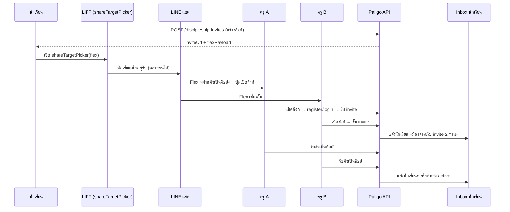

# Pain Point: นักเรียนอยากเรียนบาลี แต่ยังไม่มีครูตรวจ

วันที่: 2026-07-08  
สถานะ: **Vision / PO brief** — เก็บข้อมูลก่อน implement  
อ้างอิง: `docs/exam-inbox-v1-spec.md`, `docs/phase-social-relations-feed.md`, `docs/phase-line-reply-webhook.md`, `docs/agile/inbox-sprint-backlog.md`

---

## 1. Pain point

นักเรียนที่เข้ามาใช้แพลตฟอร์ม **อยากเรียนบาลี** และใช้สมุดข้อสอบดิจิทัลได้ แต่ **ยังไม่มีอาจารย์หรือผู้ตรวจ** ที่จะรับตรวจข้อสอบ

ผลกระทบ:

| ปัญหา | ผลต่อผู้ใช้ |
|--------|-------------|
| ไม่มี pairing | ส่งตรวจไม่ได้ · inbox ว่าง |
| ไม่รู้จะหาครูอย่างไร | ทิ้งแพลตฟอร์มกลางทาง |
| ครูคนเดียวรับภาระหนัก | ครูไม่รับ invite · นักเรียนรอนาน |

**เป้าหมายผลิตภัณฑ์:** ลดเวลาจาก «สมัครแล้ว» → «มีครูรับตรวจได้จริง» โดยไม่บังคับให้นักเรียนรู้ technical flow ล่วงหน้า

---

## 2. แนวทางแก้ปัญหา (สองทาง — ใช้คู่กันได้)

### 2.1 ทาง A — มีอาจารย์ในระบบล่วงหน้า (supply-side)

| รายละเอียด | หมายเหตุ |
|-------------|----------|
| Super admin / ops seed บัญชี `reviewer` | ดู `docs/super-admin-control-panel.md` |
| ครูในเครือข่ายวัด·โรงเรียน onboard ก่อนเปิดตัว | ลด cold-start |
| นักเรียนเลือกครูจากรายการที่พร้อมรับศิษย์ | ไม่ต้องหาครูเอง |

เหมาะกับ: เปิดตัวเป็นชุมชน/สถาบันที่มีครูอยู่แล้ว

### 2.2 ทาง B — นักเรียนตามหาครูเอง (demand-side)

| ขั้น | การทำงาน |
|------|-----------|
| 1 | นักเรียนสร้าง **invite link** ฝากตัวเป็นศิษย์ (ขยายจาก invite code ปัจจุบัน) |
| 2 | แชร์ผ่าน **LINE Flex Message** + **LIFF `shareTargetPicker`** |
| 3 | ครู/ผู้ตรวจคนใดก็ได้กดลิงก์ · **รับ invite พร้อมกันได้หลายคน** |
| 4 | ครูที่ยังไม่มีบัญชี → สมัคร · ผ่าน **invite wizard** · กด **รับตัวเป็นศิษย์** |
| 5 | นักเรียนได้รับแจ้งใน **inbox** ว่ามีใครรับแล้วบ้าง |

เหมาะกับ: นักเรียนรายบุคคลที่มีครูประจำอยู่แล้วแต่ยังไม่ได้อยู่ในระบบ

> **คำศัพท์ UI (บังคับ):** ฝากตัวเป็นศิษย์ · รับตัวเป็นศิษย์ — ตาม `docs/phase-social-relations-feed.md`

---

## 3. LINE ShareTargetPicker flow



### ข้อกำหนด Flex / LIFF

| หัวข้อ | รายละเอียด |
|--------|-------------|
| Flex bubble | ชื่อนักเรียน · ระดับ/วิชา (ถ้ามี) · ข้อความสั้น «ขอฝากตัวเป็นศิษย์เพื่อส่งข้อสอบตรวจ» |
| ปุ่มหลัก | URI → `https://app.paligo.jp/...?invite={token}` (เปิดเว็บหรือ LIFF) |
| shareTargetPicker | นักเรียนเลือก contact ครูได้หลายคนในครั้งเดียว |
| ลิงก์เดียวกัน | token เดียว · หลายครู claim ได้จนกว่านักเรียนจะปิด invite หรือครบ quota |
| ไม่ใช้ Push quota | แชร์จากฝั่งนักเรียน · สอดคล้อง `docs/phase-line-reply-webhook.md` §3.4 ทางเลือก B |

---

## 4. Invite wizard — นำทางครูเข้าสู่ระบบ

เมื่อครูเปิดลิงก์ invite (ยังไม่มีบัญชีหรือยังไม่เคยใช้ระบบ):

```text
Step 1  ยินดีต้อนรับ · อธิบายว่านักเรียนขอให้เป็นผู้ตรวจ
Step 2  สมัคร/เข้าสู่ระบบ (role=reviewer)
Step 3  โปรไฟล์ขั้นต่ำ (ชื่อที่แสดงใน inbox)
Step 4  (ทางเลือก) เชื่อม LINE — รับแจ้งการบ้านภายหลัง
Step 5  สรุปคำขอ · ปุ่ม «รับตัวเป็นศิษย์»
Step 6  ทัวร์สั้น: เมนูการบ้าน · วิธีรับเล่ม · ส่งผลกลับ
```

| หลัก UX | รายละเอียด |
|---------|-------------|
| ไม่บังคับจบทุก step ก่อนรับ | ครูที่มีบัญชีแล้วข้ามไป Step 5 ได้ |
| Deep link คง invite token | refresh ไม่หาย |
| หลังรับสำเร็จ | redirect → `exam-reviewer-console.html` หรือ inbox ครู |

---

## 5. Inbox แจ้งนักเรียน

เมื่อมีครูโต้ตอบกับ invite นักเรียนต้องเห็นใน **inbox / การแจ้งเตือนในแอป** (ไม่พึ่ง LINE อย่างเดียว):

### 5.1 เหตุการณ์ที่แจ้ง

| เหตุการณ์ | ข้อความตัวอย่าง (ไทย) |
|-----------|------------------------|
| ครูเปิดลิงก์ / รับ invite | «อาจารย์ {ชื่อ} เปิดคำเชิญแล้ว» |
| ครูกดรับตัวเป็นศิษย์ | «อาจารย์ {ชื่อ} รับตัวเป็นศิษย์แล้ว» |
| สรุปหลายครู | «มีอาจารย์รับคำเชิญ **2 ท่าน** — เลือกส่งข้อสอบให้ท่านใดก็ได้» |
| ครูเดียว | «มีอาจารย์รับคำเชิญ **1 ท่าน** — พร้อมส่งข้อสอบตรวจได้» |

### 5.2 ชี้แจงหลายผู้ตรวจ (ลดภาระครูคนเดียว)

ข้อความใน inbox ควรอธิบายชัดว่า:

- นักเรียนมีศิษย์/ผู้ตรวจได้ **มากกว่า 1 คน**
- ตอนส่งตรวจเลือกผู้รับได้ **ทีละคน** หรือแบ่งเล่มคนละข้อ (phase ถัดไป)
- เป้าหมาย: **ไม่ให้ผู้ตรวจคนเดียวรับภาระมากเกินไป**

```text
ตัวอย่างการ์ดใน inbox นักเรียน:

┌─────────────────────────────────────────┐
│ คำเชิญฝากตัวเป็นศิษย์                   │
│ มีอาจารย์รับคำเชิญ 2 ท่าน                │
│ · อ.สมชาย — รับตัวเป็นศิษย์แล้ว ✓       │
│ · อ.วิมล — รับตัวเป็นศิษย์แล้ว ✓        │
│                                         │
│ เมื่อส่งข้อสอบ เลือกผู้ตรวจที่ต้องการ    │
│ ได้ เพื่อแบ่งภาระการตรวจ                │
└─────────────────────────────────────────┘
```

---

## 6. ส่งข้อสอบหลายผู้ตรวจ (load balancing)

| ระดับ | พฤติกรรม |
|-------|----------|
| **MVP** | นักเรียนมี discipleship หลายรายการ · ตอนกด「ส่งตรวจ」เลือกผู้ตรวจ 1 คน |
| **ถัดไป** | แนะนำผู้ตรวจที่คิวน้อยกว่า (เชื่อม Phase 7 คิวตรวจ) |
| **อนาคต** | แบ่งข้อสอบเป็นชุดย่อยส่งคนละข้อ (out of scope MVP) |

ความสัมพันธ์กับ inbox ปัจจุบัน: `POST /v1/packages` ต้องรู้ `reviewer_user_id` ที่เลือก — ขยายจาก pairing เดียวเป็น **รายการ discipleship active**

---

## 7. แผน implement (อ้างอิง sprint)

| ลำดับ | Phase / งาน | ไฟล์อ้างอิง |
|-------|-------------|-------------|
| 0 | Inbox loop จบ (ส่งตรวจ ↔ รับผล) | `docs/agile/inbox-sprint-backlog.md` Phase 4 |
| 1 | ฝากตัวเป็นศิษย์ · รับตัวเป็นศิษย์ · หลายครูต่อนักเรียน | `docs/phase-social-relations-feed.md` Phase 9 |
| 2 | Invite URL + token หลายผู้รับ | เอกสารนี้ §3 |
| 3 | LINE Flex + shareTargetPicker | `docs/phase-line-reply-webhook.md` |
| 4 | Invite wizard (ครู) | เอกสารนี้ §4 · `exam-account.html` / หน้าใหม่ |
| 5 | Inbox แจ้งนักเรียน (claim / รับศิษย์) | `exam-inbox.html`, `workers/src/inbox.js` |
| 6 | เลือกผู้ตรวจตอนส่งข้อสอบ | `exam-books.html`, packages API |
| 7 | Seed ครูล่วงหน้า (ops) | `docs/super-admin-control-panel.md` |

---

## 8. API sketch (ยังไม่ implement)

| Method | Path | หมายเหตุ |
|--------|------|----------|
| POST | `/v1/discipleship-invites` | นักเรียนสร้าง invite · คืน `token`, `inviteUrl`, `flexPayload` |
| GET | `/v1/discipleship-invites/{token}` | ครูเปิดลิงก์ · metadata นักเรียน |
| POST | `/v1/discipleship-invites/{token}/accept` | ครูรับ invite (ก่อนหรือหลังรับตัวเป็นศิษย์) |
| POST | `/v1/discipleships/{id}/accept` | รับตัวเป็นศิษย์ (active) |
| GET | `/v1/me/discipleships` | รายการศิษย์/ครูของฉัน |
| GET | `/v1/inbox` | ขยาย type: `invite_opened`, `discipleship_accepted`, `invite_summary` |

---

## 9. Acceptance criteria (PO)

- [ ] นักเรียนไม่มีครู → เห็นคำแนะนำ「หาครู» + ปุ่มสร้างลิงก์เชิญ
- [ ] แชร์ LINE ผ่าน shareTargetPicker ได้ · Flex แสดงถูกต้อง
- [ ] ครูหลายคนเปิดลิงก์เดียวกันได้
- [ ] ครูใหม่ผ่าน invite wizard จนรับตัวเป็นศิษย์ได้
- [ ] นักเรียนเห็น inbox สรุป 1 ท่าน / หลายท่าน
- [ ] ส่งตรวจเลือกผู้ตรวจจากรายการที่รับศิษย์แล้ว
- [ ] (ทางเลือก) ops seed ครูล่วงหน้าผ่าน super admin

---

## 10. เปิดคำถาม

| # | คำถาม | แนวโน้ม PO |
|---|--------|------------|
| 1 | invite หมดอายุกี่วัน? | 30 วัน (สอดคล้อง inbox item) |
| 2 | จำกัดจำนวนครูต่อ invite ไหม? | ไม่จำกัด MVP · แจ้งเตือนถ้า >5 |
| 3 | ครูปฏิเสธคำเชิญได้ไหม? | ได้ · ไม่สร้าง discipleship |
| 4 | นักเรียนยกเลิก invite กลางคัน? | ได้ · token `cancelled` |

---

*เอกสารนี้เก็บ pain point และ vision ตาม brief PO — ใช้เป็นอ้างอิง sprint และออกแบบ UI ก่อนลงมือ implement*
